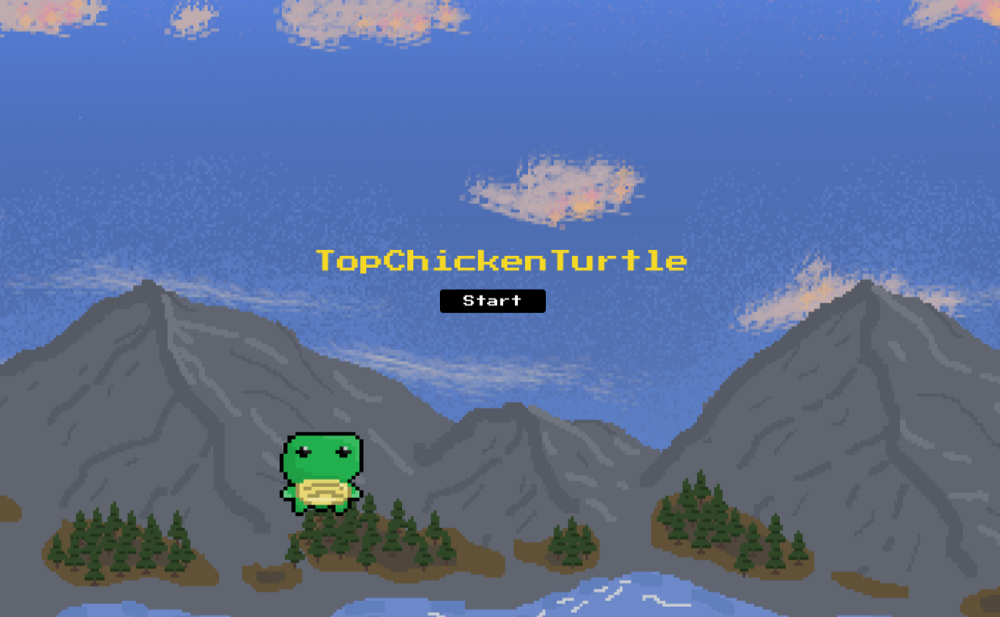
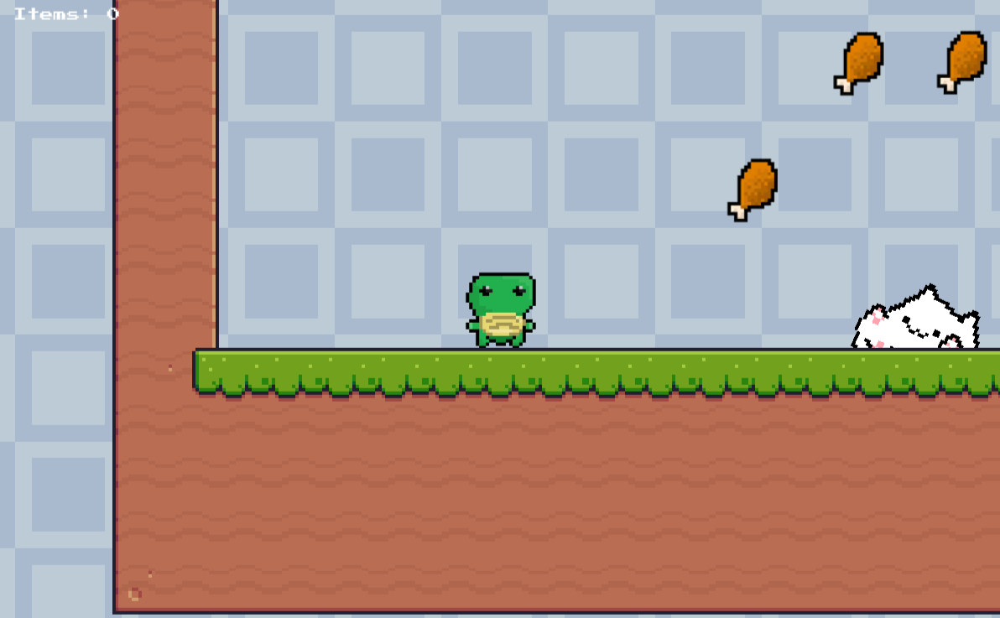

# Unity\_\_2D_Platformer 🎮 By Team TopChickenTurtle

This project is created by **Team TopChickenTurtle**, a 4-persons group collaborating through GitHub, using C# and Unity.
Our team created the game design, level designs, collision system, dynamic animation, and game-clear conditions for an immersive player experience.

## Project History

- **Creator:** Dahyun Ko, Gabriel Siewert, Juhwan Seo, MilesPurvis,
- **Development Period:** Oct/23/2023 - Oct/31/2023

## Development Environment

- **Programming Language:** `C#`
- **IDE:** `Unity`
- **Tools:** `Git & GitHub`

## Main Features

- Menu Selection
- Collision Detection
- Dynamic Animation
- Level Design
- Game Clear Condition
- Scoring System

## Game Preview

## Play Our Game

https://topchickenturtle.itch.io/topturtlechicken
